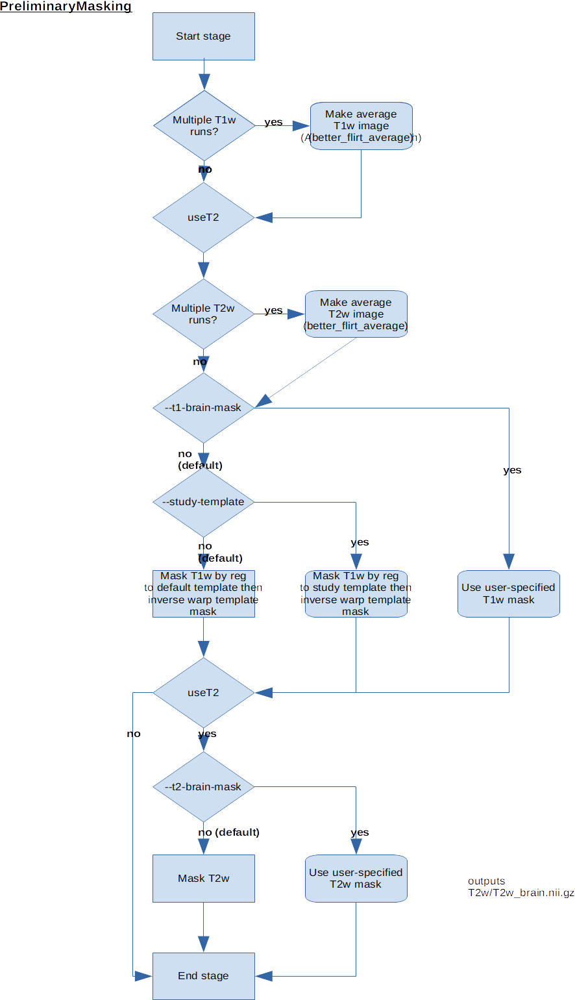
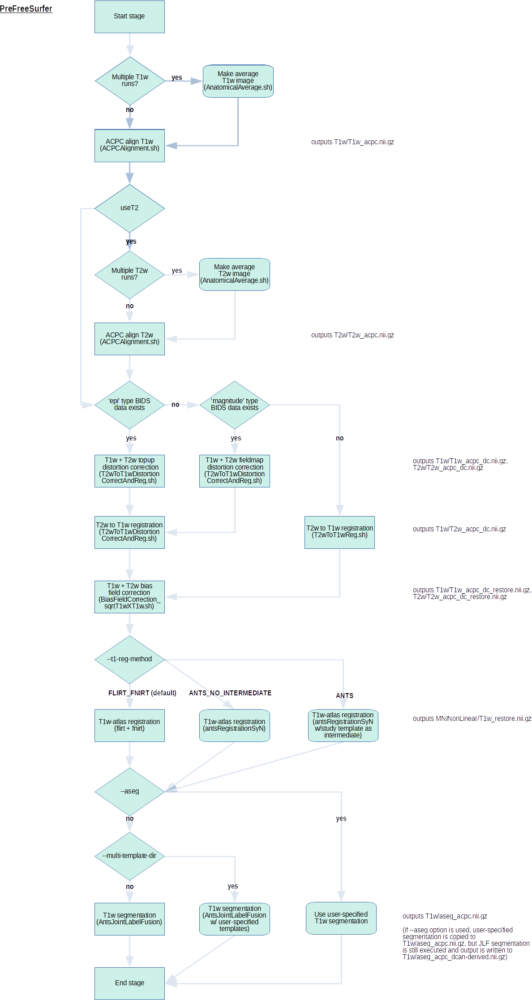
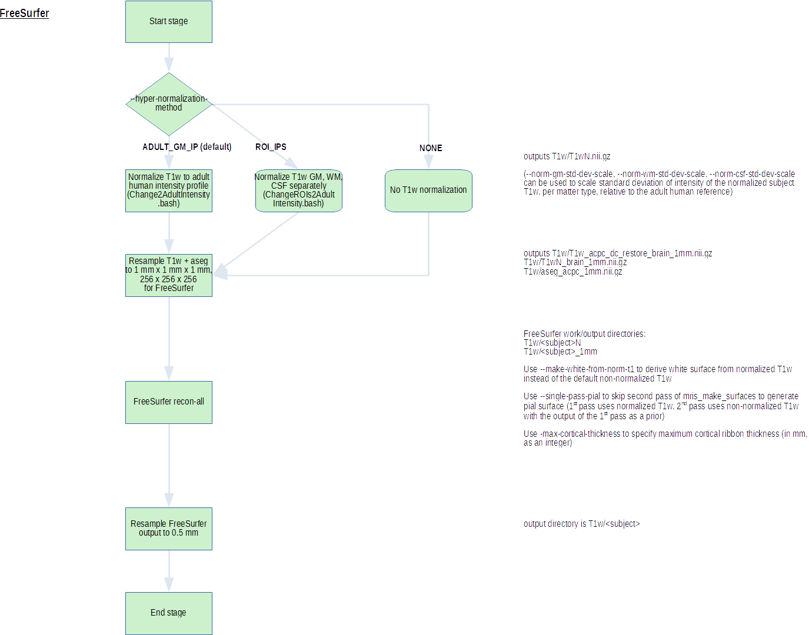
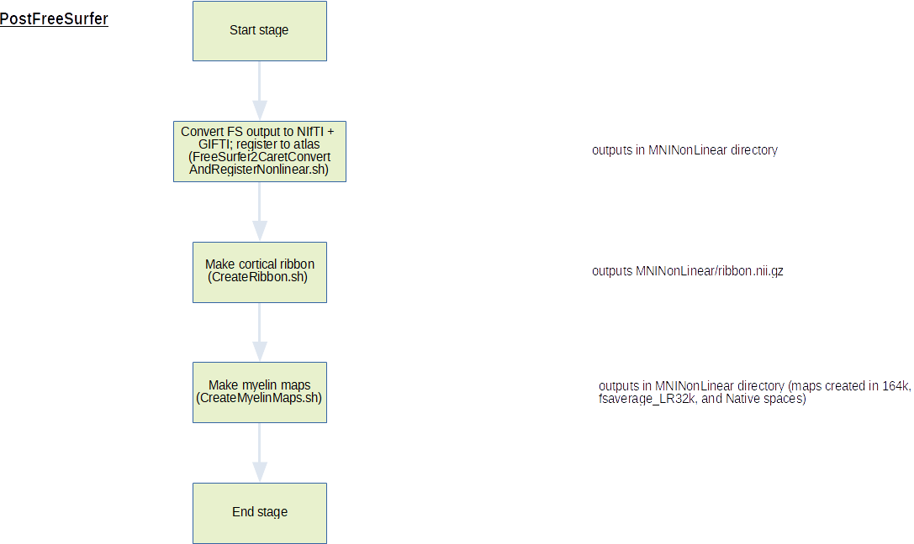
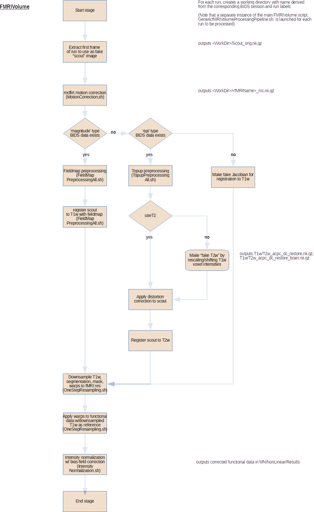
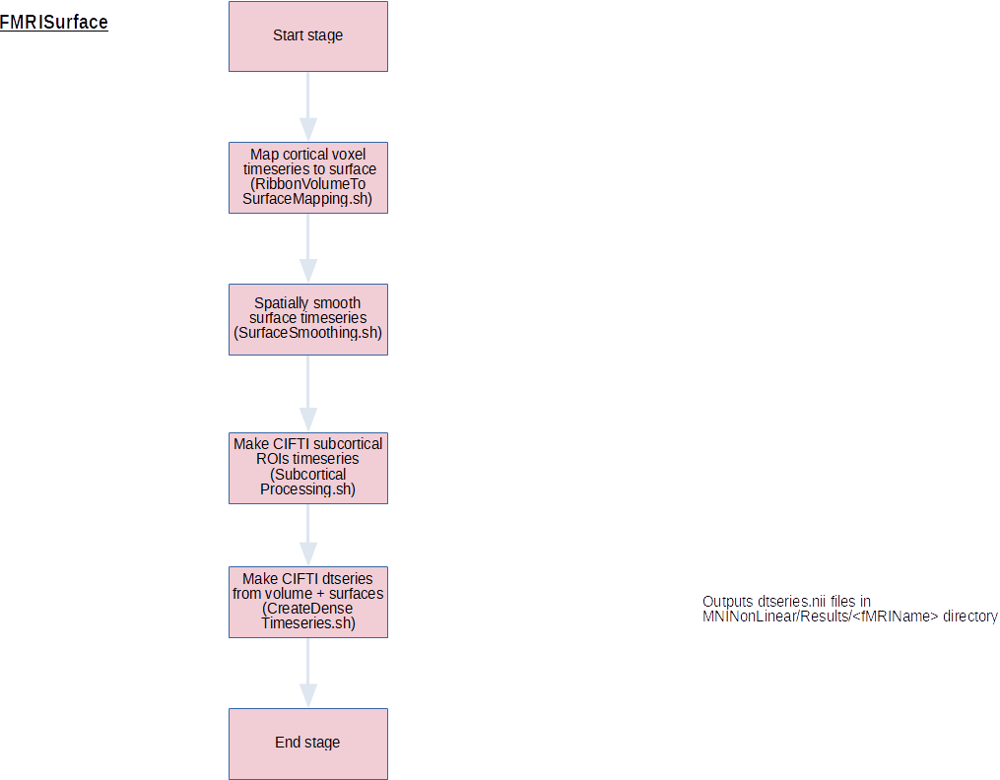
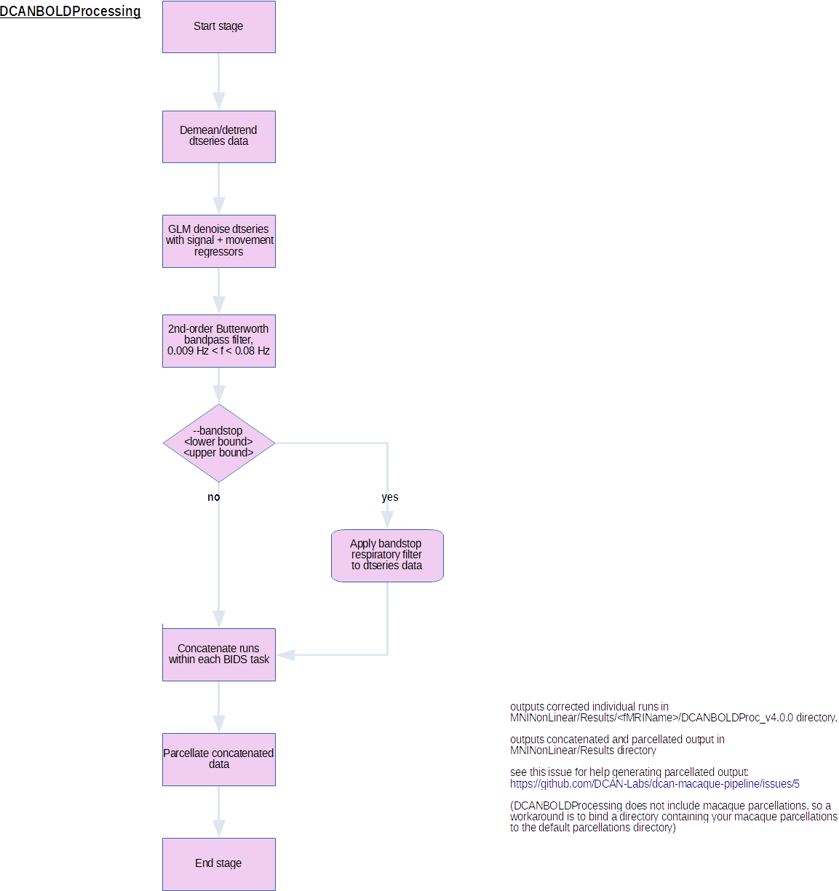
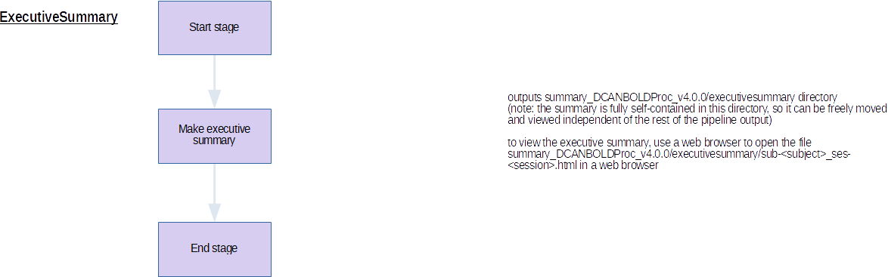

# nhp-abcd-bids-pipeline
The repository contains the [BIDS App](https://bids-apps.neuroimaging.io) for non-human primates (i.e., macaques),
used to run the dcan-macaque-pipeline.

This software takes a BIDS folder as input and determines parameters for the
DCAN Labs' modified HCP pipeline, calling upon the proper code to run the
subject(s).

## Using Docker
Before running, you will need to load the image onto your Docker service by
running the following command:
```{bash}
docker pull dcanumn/nhp-abcd-bids-pipeline
```
If you receive a "no space left on device" error during this pull process, you
may need to clean up any old/dangling images and containers from the docker
registry, and possibly increase the amount of space allocated to Docker.

## Using Singularity
You can either pull the image from the Docker repository, or build it from the
repository for the image to be saved in the working directory.
```{bash}
singularity pull docker://dcanumn/nhp-abcd-bids-pipeline

singularity build nhp-abcd-bids-pipeline.img docker://dcanumn/nhp-abcd-bids-pipeline
```
These are essentially the same, but in the latter case you have control over the
name of the file.

## Usage:
Using the image will require BIDS formatted input data. Consult
http://bids.neuroimaging.io/ for more information and for tools which assist
with converting data into BIDS format. Our favorite is Dcm2Bids.

These are the minimal command invocations. Options are detailed in Options,
below.

To call using Docker:
```{bash}
docker run --rm \
    -v /path/to/bids_dataset:/bids_input:ro \
    -v /path/to/outputs:/output \
    -v /path/to/freesurfer/license:/license \
    dcanumn/nhp-abcd-bids-pipeline /bids_input /output
    --freesurfer-license=/license [OPTIONS]
```
Notice that the FreeSurfer license is now mounted directly into the FreeSurfer
folder.

To call using Singularity:
```{bash}
env -i singularity run \
    -B /path/to/bids_dataset:/bids_input \
    -B /path/to/outputs:/output \
    -B /path/to/freesurfer/license.txt:/opt/freesurfer/license.txt \
    ./nhp-abcd-bids-pipeline.img /bids_input /output
--freesurfer-license=/opt/freesurfer/license.txt [OPTIONS]
```
Notice that the license is now mounted directly into the freesurfer folder, and
the call to singularity is prefaced by "env -i"

## Options
```{python}
usage: nhp-abcd-bids-pipeline [-h] [--version] [--aseg ASEG]
                              [--participant-label PARTICIPANT_LABEL [PARTICIPANT_LABEL ...]]
                              [--session-id SESSION_ID [SESSION_ID ...]]
                              [--all-sessions] [--ncpus NCPUS] [--stage STAGE]
                              [--bandstop LOWER UPPER]
                              [--max-cortical-thickness MAX_CORTICAL_THICKNESS]
                              [--registration-assist MOVING REFERENCE]
                              [--custom-clean JSON]
                              [--t1-brain-mask T1_BRAIN_MASK]
                              [--t2-brain-mask T2_BRAIN_MASK]
                              [--study-template HEAD BRAIN]
                              [--t1-reg-method {FLIRT_FNIRT,ANTS,ANTS_NO_INTERMEDIATE}]
                              [--check-outputs-only] [--print-commands-only]
                              [--ignore-expected-outputs]
                              [--multi-template-dir MULTI_TEMPLATE_DIR]
                              [--hyper-normalization-method {ADULT_GM_IP,ROI_IPS,NONE}]  
                              [--norm-gm-std-dev-scale SCALE_FACTOR]
                              [--norm-wm-std-dev-scale SCALE_FACTOR]
                              [--norm-csf-std-dev-scale SCALE_FACTOR]
                              [--make-white-from-norm-t1] [--single-pass-pial]
                              bids_dir output_dir

The Developmental Cognition and Neuroimaging (DCAN) lab Macaque fMRI
Pipeline [1].  This BIDS application initiates a functional MRI processing
pipeline built upon the Human Connectome Project's minimal processing
pipelines [2].  The application requires only a dataset conformed to the BIDS
specification, and little-to-no additional configuration on the part of the
user. BIDS format and applications are explained in detail at
http://bids.neuroimaging.io/

positional arguments:
  bids_dir              path to the input bids dataset root directory. Read
                        more about bids format in the link in the description.
                        It is recommended to use the dcan bids gui or dcm2bids
                        to convert from participant dicoms to bids.
  output_dir            path to the output directory for all intermediate and
                        output files from the pipeline, also path in which
                        logs are stored.

optional arguments:
  -h, --help            show this help message and exit
  --version, -v         show program's version number and exit
  --aseg ASEG           specify path to the aseg file to be used by
                        FreeSurfer; replaces the default aseg_acpc.nii.gz
                        in the subject's T1w directory. The filename of the
                        specified aseg file must be "aseg_acpc.nii.gz". 
                        Default: aseg_acpc.nii.gz in subject's T1w directory 
                        generated in PreFreeSurfer using ANTs joint label fusion.
  --participant-label PARTICIPANT_LABEL [PARTICIPANT_LABEL ...]
                        optional list of participant ids to run. Default is
                        all ids found under the bids input directory. A
                        participant label does not include "sub-"
  --session-id SESSION_ID [SESSION_ID ...]
                        filter input dataset by session id. Default is all ids
                        found under the subject input directory(s). A session
                        id does not include "ses-"
  --all-sessions        collapses all sessions into one when running a
                        subject.
  --ncpus NCPUS         number of cores to use for concurrent processing and
                        algorithmic speedups. Warning: causes ANTs and
                        FreeSurfer to produce non-deterministic results.
  --stage STAGE         begin from a given stage, continuing through. Options:
                        PreFreeSurfer, FreeSurfer, PostFreeSurfer, FMRIVolume,
                        FMRISurface, DCANBOLDProcessing, ExecutiveSummary
  --bandstop LOWER UPPER
                        parameters for motion regressor band-stop filter. It
                        is recommended for the boundaries to match the inter-
                        quartile range for participant group respiratory rate
                        (bpm), or to match bids physio data directly [3].
                        These parameters are highly recommended for data
                        acquired with a frequency of approx. 1 Hz or more
                        (TR<=1.0). Default is no filter
  --max-cortical-thickness MAX_CORTICAL_THICKNESS
                        maximum cortical thickness to allow in FreeSurfer.
                        Default = 5 mm.
  --registration-assist MOVING REFERENCE
                        provide two task/run names, a moving and a reference
                        image to assist anatomical registration. Use case:
                        ferumoxytol enhanced fmri do not register consistently
                        to T1w images under typical FSL flirt metrics. Using a
                        bold image as a reference can help with this issue.
                        e.g. task-CErest01 task-rest01
  --t1-brain-mask T1_BRAIN_MASK
                        specify the path to the mask file. The file specified
                        will be applied in place of the default masking 
                        process in PreliminaryMasking and PreFreeSurfer.
                        --t2-brain-mask may be used in conjunction with this 
                        option, but is not required. 
  --t2-brain-mask T2_BRAIN_MASK
                        specify the path to the mask file. The file specified
                        will be applied in place of the default masking 
                        process in PreliminaryMasking and PreFreeSurfer.
                        This option may be used in conjunction with 
                        --t1-brain-mask, but is not required. 
  --study-template HEAD BRAIN
                        template head and brain images for masking nonlinear
                        and optional intermediate registration of T1w to
                        standard atlas (Yerkes19). Effective to account for
                        population head shape differences in male/female and
                        in separate agencategories, or for differences in 
                        anatomical field of view. Default is to use the
                        Yerkes19 template.
  --t1-reg-method {FLIRT_FNIRT,ANTS,ANTS_NO_INTERMEDIATE}        
                        specify the method used to register subject T1w to 
                        reference during PreFreeSurfer. 
                        FLIRT_FNIRT uses FLIRT for initial affine transform 
                        then FNIRT to register to reference. 
                        ANTS performs intermediate registration to study 
                        template, then registers to reference, using 
                        antsRegistrationSyN for both. 
                        ANTS_NO_INTERMEDIATE registers directly to reference 
                        using antsRegistrationSyN. 
                        Default: FLIRT_FNIRT. 
  --multi-template-dir MULTI_TEMPLATE_DIR
                        directory for joint label fusion templates. It should
                        contain only folders which each contain a
                        "T1w_brain.nii.gz" and a "Segmentation.nii.gz". Each
                        subdirectory may have any name and any number of
                        additional files.
  --hyper-normalization-method {ADULT_GM_IP,ROI_IPS,NONE}
                        specify the intensity profiles to use for the hyper-
                        normalization step in FreeSurfer: ADULT_GM_IP adjusts
                        the entire base image such that the IP of GM in the
                        target roughly matches the IP of GM of the reference
                        (i.e., the adult freesurfer atlas). Then the WM is
                        shifted in the target image to match the histogram of
                        WM in the reference. ROI_IPS adjusts the intensity
                        profile of each ROI (GM, WM, CSF) separately and
                        reassembles the parts. NONE skips hyper-normalization
                        step. This allows the user to run PreFreeSurfer, apply
                        new, experimental hyper-normalization methods and then
                        restart at FreeSurfer. Default: ADULT_GM_IP.
  --norm-gm-std-dev-scale SCALE_FACTOR
                        specify, as a floating-point number, the scaling factor
                        for the standard deviation of GM voxels in the 
                        hypernormalized FreeSurfer T1w image relative to the
                        standard deviation of the adult reference image.
                        Reducing the standard deviation of GM voxels
                        may remedy issues with poor surface generation in
                        FreeSurfer when T1w contrast in cortical GM is uneven
                        or weak near the pial surface. Default = 1.
  --norm-wm-std-dev-scale SCALE_FACTOR
                        specify, as a floating-point number, the scaling factor
                        for the standard deviation of WM voxels in the 
                        hypernormalized FreeSurfer T1w image relative to the
                        standard deviation of the adult reference image.
                        Default = 1.
  --norm-csf-std-dev-scale SCALE_FACTOR
                        specify, as a floating-point number, the scaling factor
                        for the standard deviation of GM voxels in the 
                        hypernormalized FreeSurfer T1w image relative to the
                        standard deviation of the adult reference image.
                        This option has no effect when used with ADULT_GM_IP
                        hypernormalization. Default = 1.
  --make-white-from-norm-t1
                        use normalized T1w volume (if it exists) as input to FreeSurfer'
                        mris_make_surfaces when making white surfaces. Default = False.                     
  --single-pass-pial
                        create pial surfaces in FreeSurfer with a single pass of
                        mris_make_surfaces using hypernormalized T1w brain (if
                        hypernormalization was not omitted); omits second pass of
                        mris_make_surfaces (in which the surfaces generated in 
                        the first pass would be used as priors, and a 
                        non-hypernormalized T1w brain is used). Default = False.

special pipeline options:
  options which pertain to an alternative pipeline or an extra stage which is not
   inferred from the bids data.

  --custom-clean JSON   runs dcan cleaning script after the pipeline
                        completessuccessfully to delete pipeline outputs based
                        on the file structure specified in the custom-clean
                        json.

runtime options:
  special changes to runtime behaviors. Debugging features.

  --check-outputs-only  checks for the existence of outputs for each stage
                        then exit. Useful for debugging.
  --print-commands-only
                        print run commands for each stage to shell then exit.
  --ignore-expected-outputs
                        continues pipeline even if some expected outputs are
                        missing.

References
----------
[1] dcan-pipelines (for now, please cite [3] in use of this software)
[2] Glasser, MF. et al. The minimal preprocessing pipelines for the Human
Connectome Project. Neuroimage. 2013 Oct 15;80:105-24.
10.1016/j.neuroimage.2013.04.127
[3] Fair, D. et al. Correction of respiratory artifacts in MRI head motion
estimates. Biorxiv. 2018 June 7. doi: https://doi.org/10.1101/337360
[4] Dale, A.M., Fischl, B., Sereno, M.I., 1999. Cortical surface-based
analysis. I. Segmentation and surface reconstruction. Neuroimage 9, 179-194.
[5] M. Jenkinson, C.F. Beckmann, T.E. Behrens, M.W. Woolrich, S.M. Smith. FSL.
NeuroImage, 62:782-90, 2012
[6] Avants, BB et al. The Insight ToolKit image registration framework. Front
Neuroinform. 2014 Apr 28;8:44. doi: 10.3389/fninf.2014.00044. eCollection 2014.
```

## Building the Docker Image
This repository contains the Dockerfile (and other files) needed to create the
docker image that will contain the BIDs app and the pipeline scripts. This version
does not require a ready-built DCAN-Labs internal-tools as prior releases have; the
contents of the internal-tools Dockerfile are now integrated into
the nhp-abcd-bids-pipeline Dockerfile.

### Additional Information:

#### Pipeline stages

See the [pipeline stages summary doc](nhp-abcd-bids-pipeline/blob/master/dcan-macaque-pipeline_v0_1_0_stages_summary.pdf) for key inputs and outputs of each stage, plus tips for reviewing and troubleshooting output.










#### Outputs

The outputs are organized in the following structure:

output_dir/sub-id/ses-session/
- files/
- logs/

##### files

- T1w:  contains native space anatomical data as well as intermediate 
preprocessing files. 
- T1w/participantID: The participant ID folder within T1w is the FreeSurfer 
subject folder. 
- T2w:  contains native space anatomical data as well as intermediate 
preprocessing files.
- MNINonLinear: contains the final space results of anatomy in 164k 
resolution. 
- MNINonLinear/Results: final space functional data.
- MNINonLinear/fsaverage_32K: final space anatomy in 32k resolution, where 
functional data is ultimately projected.
- task-taskname: these folders contain intermediate functional preprocessing 
files.
- summary_DCANBOLDProc_ver/executivesummary: the .html file within can be opened for quality 
inspection of pipeline results.

#### NOTE: about "MNINonLinear"

The name of the "MNINonLinear" output directory was inherited from DCAN-HCP BIDS app / abcd-bids-pipeline, in which the standard output space is MNINonLinear. In this pipeline, images in the "MNINonLinear" directory are actually in MacaqueYerkes19 space.

##### logs

logs contains the log files for each stage. In the case of an error, consult 
these files in addition to the standard err/out of the app itself (by 
default this is printed to the command line).

status.json codes:

- unchecked: 999
- succeeded: 1
- incomplete: 2
- failed: 3
- not_started: 4


#### Rerunning

The --stage option exists so you can restart the pipeline in the case that 
it terminated prematurely.

#### Misc.

Temporary/Scratch space:  By default, everything is processed in the 
output folder. We may work on a more efficient use of disk space in the 
future, along with the ability to use a temporary file system mount for
hot read/writes.

software will resolve to using spin echo field maps if they are present, 
then gradient field maps, then None, consistent with best observed
performances. Note that there are no errors or warnings if multiple 
modalities are present.

For specified use of spin echo field maps, i.e. mapping a pair to each
individual functional run, it is necessary to insert the "IntendedFor"
field into the bids input sidecar jsons, which specifies a functional
run for each field map.  This field is explained in greater detail
within the bids specification.

In the case of multiband (fast TR) data, it is recommended to employ a
band-stop filter to mitigate artifactually high motion numbers.  The
band-stop filter used on motion regressors prior to frame-wise
displacement calculation has parameters which must be chosen based on
subject respiratory rate.

#### Some current limitations

The ideal motion filtering parameters have not been robustly tested
across repetition times or populations. Additionally, automatic reading
of physio data from bids format has not yet been implemented, so the
proper range should be decided upon carefully.

software does not currently support dynamic acquisition parameters for
a single modality e.g. different phase encoding direction for 2 fmri in BIDS 
dir (but okay to have opposing PE direction scans in BIDS fmap dir for FSL topup). 
Other parameters would have to be processed by creating separate bids
datasets for sessions with varied fmri parameters. Errors will occur during FMRIVolume
when multiple runs exist with same BIDS ses-, task- (and optionally run-) label;
e.g. runs that must be differentiated by acq- label.
